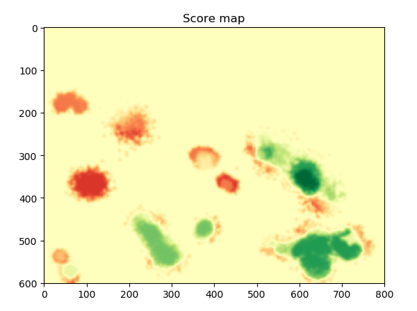

# CloudEater

GEOSS Hackathon demo of a gamifying approach to cloud classification.


## Install instructions
```
git clone https://github.com/mt-krainski/cloudEater.git
cd cloudEater
pip install -r requirements.txt
python newMain.py
```

## Gameplay


 - The player controls a "cloud-eating" airplane on a randomly chosen Sentinel-2 satellite image.
Their objective is to mark all the clouds in the picture.
 - After the player is satisfied with the selection, they submit the cloud marking using `W`. The player's
submission is compared and heuristically scored against other submissions in the database, or the ground-truth data (if known).
 - All players' submitted data for each image is collected and can be used to reconstruct the cloud cover using
statistical methods.


Player's submission.


Heatmap of previous guesses in the database - bright areas are very likely to be clouds, since many players marked them. Areas with only one
or two submissions are most likely outliers.



Scoring of the player - the player receives positive points for green areas, and negative points for red areas.
